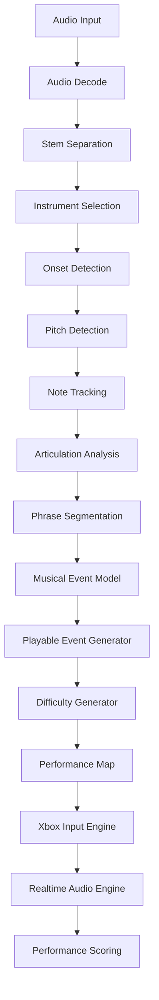

# BLACKMAMBA PICK 🎮🎸

**Turn any song into a playable performance.**

BLACKMAMBA PICK convierte una canción existente en una estructura musical interpretable mediante un control de Xbox.

La idea central es sencilla:

> **La canción define qué notas existen. El jugador decide cuándo y cómo ocurren.**

El sistema analiza una canción, separa sus componentes, detecta notas y ataques, construye una representación matemática de la interpretación y finalmente convierte esa información en una secuencia jugable.

El control no funciona únicamente como una botonera. Los sticks, gatillos y botones se convierten en elementos expresivos capaces de controlar ataque, timing, intensidad, articulación, sustain, octava, posición, bend, vibrato, dinámica y selección de frase.

---

## 1. Visión

BLACKMAMBA PICK busca convertir música terminada en un instrumento interactivo.

El usuario puede importar:

```text
WAV
MP3
FLAC
AIFF
```

El motor procesa la canción:

```text
SONG
 ↓
STEMS
 ↓
INSTRUMENT
 ↓
NOTES
 ↓
EVENTS
 ↓
PLAY MAP
 ↓
XBOX CONTROLLER
 ↓
PERFORMANCE
```

El resultado no es únicamente un videojuego musical. Es un **motor de reinterpretación musical**.

---

## 2. Principio fundamental

Un juego musical tradicional funciona así:

```text
MÚSICA
 ↓
el jugador intenta seguirla
```

BLACKMAMBA PICK invierte la relación:

```text
PARTITURA INTERNA
 ↓
el jugador ejecuta
 ↓
la música responde
```

La canción proporciona:

```text
qué nota
qué duración
qué articulación
qué secuencia
qué frase
```

El jugador aporta:

```text
cuándo
qué tan fuerte
qué tan rápido
con qué intención
con qué continuidad
```

Por lo tanto:

```text
OUTPUT = SONG_DATA × HUMAN_PERFORMANCE
```

---

## 3. Caso de uso inicial

Primer objetivo:

> Importar una canción de BlackMamba RECORDS, aislar un requinto o guitarra principal y convertir cada punteada en un evento ejecutable con el stick de un control Xbox.

Ejemplo original:

```text
E4 → G4 → A4 → B4 → A4
```

El jugador realiza:

```text
→ ← → ← →
```

Cada movimiento consume el siguiente evento musical. La secuencia de notas ya está definida. El usuario controla la interpretación.

---

## 4. Flujo principal

El usuario selecciona:

```text
Add Song
```

Entrada:

```text
song.wav
```

El sistema genera un proyecto:

```text
projects/
└── song_name/
```

Flujo completo:

```text
IMPORT
  ↓
ANALYZE
  ↓
REVIEW
  ↓
PLAY
```

---

## 5. Pipeline de procesamiento



---

## 6. Separación de stems

La canción puede separarse en:

```text
vocals
drums
bass
guitar
other
```

Cuando sea posible:

```text
lead_guitar
rhythm_guitar
requinto
bass
vocals
drums
```

El motor debe trabajar mediante adaptadores:

```text
StemBackend
├── DemucsAdapter
├── UVRAdapter
├── CustomAdapter
└── MEngineAdapter
```

Esto evita depender permanentemente de una sola tecnología.

---

## 7. Selección del instrumento

Después de separar stems:

```text
Select Instrument

[ ] Vocals
[ ] Bass
[X] Requinto
[ ] Drums
[ ] Guitar
```

También debe existir:

```text
AUTO DETECT
```

---

## 8. Detección de ataques

Cada nota necesita inicialmente un **onset**.

Ejemplo:

```text
0.000
0.184
0.326
0.511
0.744
```

Estos puntos representan ataques musicales. Cada ataque puede transformarse posteriormente en un golpe jugable.

---

## 9. Detección de pitch

Para cada evento:

```text
frequency → pitch
```

Ejemplo:

```text
329.63 Hz → E4
392.00 Hz → G4
440.00 Hz → A4
493.88 Hz → B4
```

También se conserva la frecuencia real. No debemos reducir inmediatamente todo a MIDI.

```json
{
  "frequency": 438.9,
  "midi_float": 68.956,
  "nearest_note": "A4"
}
```

Esto permite conservar desafinación humana, bends, vibrato, slides y microtonalidad.

---

## 10. MusicalEvent

La unidad fundamental de BLACKMAMBA PICK será `MusicalEvent`.

```json
{
  "id": "note_00421",
  "time": 12.438,
  "duration": 0.184,
  "pitch": {
    "note": "E5",
    "midi": 76,
    "frequency": 659.25
  },
  "velocity": 91,
  "articulation": "picked",
  "phrase": 7,
  "interval_from_previous": 3,
  "confidence": 0.96
}
```

---

## 11. Dos capas separadas

Nunca debemos mezclar la verdad musical con la lógica del juego.

### Musical Layer

Describe lo que existe realmente en la canción:

```text
pitch
onset
duration
velocity
frequency
articulation
bend
vibrato
phrase
```

### Gameplay Layer

Describe cómo ejecutar ese evento:

```text
stick
direction
button
octave
timing_window
difficulty
gesture
```

Ejemplo:

```json
{
  "musical_event": "note_00421",
  "input": {
    "device": "xbox",
    "control": "right_stick",
    "gesture": "flick",
    "direction": "right"
  },
  "difficulty": "hard"
}
```

Esta separación es crítica porque permite cambiar el sistema de control sin volver a analizar la canción.

---

## 12. Xbox Controller

### MVP

Inicialmente:

```text
RIGHT STICK = PICK
```

Movimiento:

```text
RIGHT → NOTE
LEFT  → NOTE
RIGHT → NOTE
LEFT  → NOTE
```

Esto imita conceptualmente el **alternate picking**.

---

## 13. Datos del stick

No trataremos el stick como un simple botón. Leeremos:

```text
X
Y
velocity
acceleration
direction
distance
attack_time
release_time
return_velocity
```

Ejemplo:

```json
{
  "x": 0.92,
  "y": 0.11,
  "velocity": 0.84,
  "acceleration": 1.17,
  "direction": "right",
  "distance": 0.91,
  "timestamp": 12438.41
}
```

---

## 14. Conversión movimiento → interpretación

La energía del gesto puede alimentar la intensidad musical:

```text
stick velocity
      ↓
note velocity
```

Ejemplo:

```text
0.20 → pianissimo
0.40 → piano
0.60 → medium
0.80 → forte
1.00 → fortissimo
```

No tiene que ser una relación estrictamente lineal:

```text
velocity_out = pow(stick_velocity, γ)
```

`γ` controla la sensibilidad.

---

## 15. Tiempo entre golpes

Si `tₙ` representa el golpe actual:

```text
Δt = tₙ - tₙ₋₁
```

Este valor permite calcular velocidad interpretativa, estabilidad, groove, aceleración, retardos y fluidez.

---

## 16. Timing

Para cada nota existe un `target_time` y para cada acción humana un `player_time`.

```text
timing_error = |player_time - target_time|
```

Ventanas iniciales configurables:

```text
PERFECT  ≤ 25 ms
GREAT    ≤ 50 ms
GOOD     ≤ 90 ms
LOOSE    ≤ 150 ms
MISS     > 150 ms
```

---

## 17. No sobrecuantizar

BLACKMAMBA PICK no debe destruir la interpretación humana.

Una ejecución ligeramente adelantada o atrasada puede ser musicalmente correcta.

```text
human timing ≠ error
```

El objetivo es medir **musical coherence**, no únicamente alineación perfecta con una cuadrícula.

---

## 18. Articulación

Los gestos deben poder producir diferentes articulaciones:

```text
flick corto
→ staccato

flick fuerte
→ accent

movimiento largo
→ sustain

movimiento rápido
→ hard pick

movimiento suave
→ soft pick
```

Futuro:

```text
circular gesture
→ vibrato

stick hold
→ sustain

rapid reverse
→ mute

trigger + stick
→ bend
```

---

## 19. Botones como trastes

Después del MVP podremos agregar:

```text
A
B
X
Y
```

Estos botones pueden representar posiciones, intervalos, trastes, zonas de acordes o zonas de escala.

No tienen por qué significar notas individuales rígidas.

---

## 20. Octavas

Propuesta:

```text
LB = octave -
RB = octave +
```

Ejemplo:

```text
LB + NOTE → E3
NOTE      → E4
RB + NOTE → E5
```

---

## 21. Gatillos

Propuesta futura:

```text
LT → bend / expression
RT → sustain / intensity
```

Debido a que los triggers son analógicos (`0.0 → 1.0`) podemos obtener control continuo.

---

## 22. Stick izquierdo

Versión futura:

```text
LEFT STICK = NECK POSITION
```

Posiciones posibles:

```text
LOW
MID
HIGH
LEAD
```

O matemáticamente:

```text
position ∈ [0,1]
```

mapeado a registro, zona de escala, voicing, octava o variación de frase.

---

## 23. Phrases

Las notas no deben existir únicamente como eventos aislados:

```text
NOTE
 ↓
MOTIF
 ↓
PHRASE
 ↓
SECTION
 ↓
SONG
```

Ejemplo:

```text
SONG
├── Intro
│   └── 18 events
├── Verse
│   └── 46 events
├── Fill
│   └── 11 events
├── Chorus
│   └── 62 events
└── Solo
    └── 93 events
```

---

## 24. Phrase segmentation

Podemos detectar frases mediante:

```text
silence
note density
pitch contour
repetition
energy
harmonic changes
interval patterns
```

Una pausa suficientemente larga puede definir un `phrase boundary`.

---

## 25. Difficulty Engine

Una sola canción puede generar múltiples versiones jugables.

### EASY

Sólo ataques fundamentales.

### NORMAL

Notas principales y fills importantes.

### HARD

Prácticamente toda la ejecución original.

### BLACKMAMBA

```text
EVERY.
SINGLE.
NOTE.
```

Incluye ornaments, ghost notes, fast runs, slides, bends, grace notes, microtiming y variaciones dinámicas.

---

## 26. Simplificación automática

Supongamos una frase:

```text
1 2 3 4 5 6 7 8 9
```

HARD:

```text
1 2 3 4 5 6 7 8 9
```

NORMAL:

```text
1 2 3 5 7 9
```

EASY:

```text
1 3 5 9
```

Siempre conservando la identidad melódica.

---

## 27. Performance Engine

Durante ejecución:

```text
ControllerEvent
      +
MusicalEvent
      ↓
PerformanceEvent
```

Ejemplo:

```json
{
  "target_event": "note_00421",
  "player": {
    "timestamp": 12.451,
    "stick_velocity": 0.82,
    "acceleration": 1.14,
    "direction": "right"
  },
  "result": {
    "timing_error_ms": 13,
    "rating": "PERFECT",
    "velocity_output": 97
  }
}
```

---

## 28. Scoring

El puntaje no debe depender únicamente del tiempo.

```text
Score =
Timing
+
Dynamics
+
Articulation
+
Continuity
+
Accuracy
```

Formalmente:

```text
S = wₜT + wᵥV + wₐA + w꜀C + wₚP
```

con:

```text
T = timing
V = velocity/dynamics
A = articulation
C = continuity
P = pitch/position accuracy
Σw = 1
```

---

## 29. Flow Score

Queremos medir algo adicional: **FLOW**.

El sistema deberá observar:

```text
inter-event consistency
acceleration continuity
rhythmic stability
phrase completion
gesture continuity
```

---

## 30. Performance vs Accuracy

Dos métricas diferentes:

```text
ACCURACY
```

¿Cuánto respetó la partitura?

```text
PERFORMANCE
```

¿Qué tan musical fue la interpretación?

Esto permite resultados como:

```text
Accuracy:     92%
Performance: 98%
```

Una ejecución humana ligeramente libre podría tener mejor Performance que una ejecución perfectamente cuantizada.

---

## 31. Playback Engine

Primer MVP: cada golpe reproduce el siguiente evento.

```text
gesture
 ↓
event++
 ↓
play(note)
```

Pseudocódigo:

```python
def on_pick(gesture):
    event = sequence[current_event]
    velocity = map_gesture_velocity(gesture.velocity)

    play(
        event.pitch,
        velocity,
        event.duration
    )

    current_event += 1
```

---

## 32. Modos de reproducción

### Sequential Mode

Cada gesto reproduce la siguiente nota.

```text
GESTURE → NEXT EVENT
```

Ideal para prototipo, aprendizaje y arcade.

### Timeline Mode

El jugador debe ejecutar cada evento cerca de su tiempo original.

```text
timeline + gestures
```

Ideal para performance, scoring y canción completa.

### Adaptive Mode

Modo futuro donde la canción puede alterar ligeramente su velocidad para seguir al intérprete:

```text
PLAYER TEMPO
      ↓
TEMPO ESTIMATION
      ↓
SONG FOLLOWER
```

En lugar de que el jugador siga rígidamente la canción, canción y jugador negocian el tempo.

---

## 33. Visualización

La interfaz debe priorizar claridad. No frases innecesarias.

Tarjetas por módulo:

```text
IMPORT
STEMS
NOTES
PLAY
SCORE
SETTINGS
```

La función debe entenderse por nombre, icono, estado y jerarquía visual.

---

## 34. PLAY UI

```text
┌─────────────────────────────┐
│       BLACKMAMBA PICK       │
│                             │
│             ♪               │
│                             │
│        NEXT EVENT           │
│                             │
│      ←   ●   →              │
│                             │
│         PERFECT             │
│                             │
│  SCORE              98.2%   │
└─────────────────────────────┘
```

---

## 35. Visualización tipo tablatura

```text
TIME →
──────────────────────────────

           ●
      ●
                ●
 ●

──────────────────────────────
```

Los eventos se aproximan al punto de ejecución, pero la visualización debe representar **música real**, no solamente targets gráficos.

---

## 36. Editor de eventos

Después del análisis debe existir `REVIEW` para:

- mover onset;
- eliminar nota falsa;
- agregar nota;
- corregir pitch;
- unir notas;
- dividir notas;
- editar duración;
- editar articulación;
- crear frase;
- cambiar dificultad.

---

## 37. Confidence

Cada evento automático debe tener `confidence`.

```text
0.99
0.94
0.88
0.43
```

Eventos bajo cierto umbral pueden marcarse como `REVIEW`.

---

## 38. Proyecto generado

```text
projects/
└── dub_protocol/
    ├── source/
    │   └── original.wav
    ├── stems/
    │   ├── vocals.wav
    │   ├── drums.wav
    │   ├── bass.wav
    │   └── guitar.wav
    ├── analysis/
    │   ├── onsets.json
    │   ├── pitches.json
    │   ├── phrases.json
    │   └── articulations.json
    ├── midi/
    │   └── guitar.mid
    ├── maps/
    │   ├── easy.json
    │   ├── normal.json
    │   ├── hard.json
    │   └── blackmamba.json
    └── project.json
```

---

## 39. Arquitectura del repositorio

```text
blackmamba-pick/
├── apps/
│   ├── desktop/
│   └── web/
├── core/
│   ├── audio/
│   ├── stems/
│   ├── onset/
│   ├── pitch/
│   ├── notes/
│   ├── phrases/
│   ├── articulation/
│   └── scoring/
├── controllers/
│   ├── xbox/
│   └── generic/
├── engine/
│   ├── player/
│   ├── timing/
│   ├── gestures/
│   └── performance/
├── adapters/
│   ├── demucs/
│   ├── midi/
│   └── mengine/
├── schemas/
│   ├── song.schema.json
│   ├── event.schema.json
│   ├── map.schema.json
│   └── performance.schema.json
├── tests/
├── examples/
├── docs/
└── README.md
```

---

## 40. Core

El núcleo no debe conocer Xbox.

`CORE` trabaja únicamente con conceptos musicales:

```text
MusicalEvent
Phrase
Song
Timing
Gesture
Performance
```

---

## 41. Controller Adapter

Xbox será un adaptador:

```text
XboxInput
 ↓
GenericGesture
```

Ejemplo:

```json
{
  "type": "pick",
  "direction": "right",
  "strength": 0.82,
  "velocity": 0.91
}
```

El core sólo recibe `GenericGesture`.

Por lo tanto después podemos utilizar:

```text
Xbox
PlayStation
keyboard
MIDI
mobile
camera
IMU
custom hardware
```

sin modificar el motor musical.

---

## 42. Xbox deadzone

Los sticks presentan ruido cerca del centro. Debemos definir una `DEADZONE`.

Ejemplo inicial:

```text
0.15
```

Por debajo se ignora la entrada.

---

## 43. Gesture detection

Un golpe válido puede definirse:

```text
CENTER
 ↓
threshold crossed
 ↓
peak
 ↓
return
 ↓
GESTURE COMPLETE
```

Estados:

```text
IDLE
ATTACK
PEAK
RETURN
READY
```

Esto evita disparar múltiples notas accidentalmente durante un solo movimiento.

---

## 44. Retrigger protection

Después de disparar, el sistema bloquea el siguiente disparo hasta que el stick regrese a neutral.

Ejemplo:

```text
trigger threshold = 0.65
reset threshold   = 0.25
```

---

## 45. Direction

Podemos definir:

```text
RIGHT
LEFT
UP
DOWN
DIAGONALS
```

Pero el MVP usará solamente:

```text
LEFT
RIGHT
```

para mantener una relación clara con púa alternada.

---

## 46. Calibration

Cada jugador podrá calibrar:

```text
stick sensitivity
deadzone
attack threshold
velocity curve
timing tolerance
```

Ejemplo:

```text
profiles/
└── iyari.json
```

---

## 47. Latencia

La latencia es crítica.

Objetivo perceptual:

```text
controller input → sound output
```

Ideal:

```text
< 20 ms
```

Deseable cuando el stack lo permita:

```text
< 10 ms
```

El sistema deberá medir:

```text
input latency
processing latency
audio buffer latency
total latency
```

---

## 48. Audio Engine

Opciones:

```text
sample playback
synth playback
MIDI instrument
stem slicing
spectral reconstruction
MEngine backend
```

---

## 49. Stem slicing

Una posibilidad especialmente importante es extraer directamente de la interpretación original el fragmento de audio correspondiente a una nota.

Esto conserva:

```text
tone
attack
pick noise
amp
room
expression
```

Cada evento puede apuntar a un `audio_slice`:

```json
{
  "event": "note_421",
  "slice": {
    "start": 12.438,
    "end": 12.622
  }
}
```

Esto permite literalmente **desarmar una guitarra grabada y volverla a tocar con el control**.

---

## 50. Hybrid Engine

La mejor solución futura probablemente será híbrida:

```text
ORIGINAL AUDIO
+
PITCH DATA
+
SYNTH
+
TIME STRETCH
```

Así podemos conservar el timbre original y permitir variaciones expresivas.

---

## 51. MIDI

El MIDI será una representación útil, pero no la verdad absoluta.

```text
audio analysis
→ high resolution musical events
→ MIDI export
```

No:

```text
audio
→ MIDI
→ destroy original information
```

Los datos originales deberán mantenerse.

---

## 52. Representación matemática

Cada evento puede representarse:

```text
Eₙ = (t, Δt, f, p, v, d, a, b, φ)
```

Donde:

```text
t  = onset
Δt = duration
f  = frequency
p  = pitch
v  = velocity
d  = dynamics
a  = articulation
b  = bend
φ  = phrase
```

Cada gesto:

```text
Gₙ = (t, x, y, v, a, θ, r)
```

Donde:

```text
t = timestamp
x = horizontal position
y = vertical position
v = velocity
a = acceleration
θ = direction
r = travel distance
```

Finalmente:

```text
Pₙ = F(Eₙ, Gₙ)
```

Esto representa la nota finalmente interpretada.

---

## 53. MVP 0

Objetivo:

> demostrar que mover el stick puede sentirse como tocar una punteada.

Características:

```text
1 audio file
1 selected phrase
manual notes allowed
Xbox controller
right stick
sequential playback
```

Sin scoring, UI compleja, dificultad, IA ni stems automáticos.

---

## 54. MVP 1

```text
Import song
↓
extract stem
↓
detect notes
↓
generate events
↓
right-stick playback
```

---

## 55. MVP 2

Agregar:

```text
timing
velocity
alternate picking
score
phrase detection
```

---

## 56. MVP 3

Agregar:

```text
A/B/X/Y
octaves
triggers
bend
sustain
difficulty
editor
```

---

## 57. MVP 4

Agregar:

```text
adaptive tempo
full songs
multiplayer
training
recording
performance export
```

---

## 58. Prueba inicial

La primera prueba oficial debe utilizar **10–20 segundos** de una punteada clara.

Procedimiento:

```text
1. elegir canción
2. elegir requinto
3. aislar fragmento
4. detectar ataques
5. detectar notas
6. crear MusicalEvents
7. conectar Xbox
8. mapear stick derecho
9. ejecutar frase
10. evaluar sensación
```

La pregunta de validación no será:

> ¿funciona técnicamente?

Sino:

> **¿se siente como tocar?**

---

## 59. Métricas iniciales

Medir:

```text
input latency
false triggers
missed gestures
timing deviation
gesture consistency
note detection accuracy
phrase completion rate
```

---

## 60. Validación

Una feature no pasa únicamente porque produzca audio.

Debe cumplir:

```text
INPUT
↓
DETECTION
↓
MAPPING
↓
OUTPUT
↓
READ BACK
↓
COMPARE
↓
CERTIFY
```

Filosofía:

```text
READ
→ PLAN
→ WRITE
→ READ BACK
→ COMPARE
→ CERTIFY
```

---

## 61. Invariantes

### Evento único

```text
1 gesture = maximum 1 note trigger
```

salvo gestos explícitamente definidos como múltiples.

### Orden

En Sequential Mode, `event[n]` nunca debe reproducirse antes de `event[n-1]`.

### Determinismo

Misma canción + misma configuración debe producir el mismo mapa de eventos dentro de tolerancias declaradas.

### Reversibilidad

Nunca destruir el archivo original.

---

## 62. Original preservation

Todos los procesos deben ser no destructivos.

```text
source/
```

es inmutable.

Todo resultado se genera en `derived/` o directorios equivalentes.

---

## 63. Versionado del análisis

Cada procesamiento debe registrar:

```json
{
  "analysis_version": "0.1.0",
  "stem_backend": "demucs",
  "pitch_backend": "example",
  "settings_hash": "..."
}
```

De esta forma podemos reproducir resultados.

---

## 64. Hashing y cache

Cada archivo importado debe tener SHA-256 para identidad, deduplicación, cache y reproducibilidad.

Si la canción ya fue procesada con exactamente:

```text
same source
same model
same settings
```

no debe repetirse el análisis.

---

## 65. Seguridad de contenido

BLACKMAMBA PICK trabaja preferentemente con música propia, material autorizado o archivos para los cuales el usuario posee derechos suficientes.

La separación de stems y análisis se realizarán localmente cuando sea posible.

---

## 66. Integración con MEngine

BLACKMAMBA PICK puede convertirse en módulo de MEngine:

```text
MEngine
├── Ear
├── Judge
├── Generator
├── Voice
├── Player
└── Pick
```

PICK puede reutilizar `Ear` para analizar y `Judge` para evaluar interpretación.

---

## 67. Entrenamiento futuro

El sistema puede convertirse en herramienta pedagógica.

Ejemplo:

```text
PHRASE 01
80 BPM
```

Jugador completa y posteriormente:

```text
85 BPM
90 BPM
95 BPM
...
```

hasta alcanzar velocidad original.

---

## 68. Practice Loop

Seleccionar una frase y repetirla en loop hasta dominarla.

---

## 69. Slow Mode

Una frase puede ejecutarse:

```text
50%
60%
70%
80%
90%
100%
```

sin modificar pitch.

---

## 70. Ghost Mode

El sistema reproduce la interpretación original como referencia y reduce progresivamente su volumen:

```text
100%
75%
50%
25%
0%
```

hasta que el jugador toca solo.

---

## 71. Performance Recording

Cada sesión puede almacenarse:

```text
sessions/
```

Ejemplo:

```json
{
  "song": "Dub Protocol",
  "difficulty": "blackmamba",
  "accuracy": 0.927,
  "performance": 0.981,
  "max_combo": 143
}
```

---

## 72. Replay

Como almacenamos timestamps, velocity, direction y expression, podemos reproducir una interpretación anterior.

---

## 73. Human Signature

Con suficiente información podremos construir un `Player Performance Profile`:

```text
average timing offset
dynamic range
attack strength
preferred direction
tempo stability
gesture acceleration
```

Esto puede convertirse en una **firma interpretativa**.

---

## 74. Generación futura

El sistema eventualmente podrá hacer lo contrario.

No sólo:

```text
SONG → PLAY MAP
```

sino:

```text
PLAYER PERFORMANCE → NEW MUSIC
```

La manera particular en que alguien utiliza el control puede convertirse en material musical.

---

## 75. Hardware futuro

El sistema no depende permanentemente de Xbox.

Futuros controladores:

```text
custom pick controller
IMU pick
wearable
phone
camera tracking
finger sensors
MIDI guitar
ESP32 controller
```

Xbox es nuestro primer instrumento físico.

---

## 76. Objetivo final

BLACKMAMBA PICK debe permitir esto:

```text
ADD SONG
```

El sistema responde:

```text
ANALYZING...
```

Después:

```text
STEMS      ✓
NOTES      ✓
PHRASES    ✓
PLAY MAP   ✓
READY
```

Y finalmente:

```text
PLAY
```

El usuario toma un control, mueve el stick y toca la canción.

---

## Filosofía

No estamos intentando convertir un Xbox Controller en una guitarra.

Estamos construyendo:

> **una nueva interfaz musical que utiliza la lógica corporal del control para ejecutar estructuras musicales reales.**

La canción es la partitura.

El control es el instrumento.

El jugador es el intérprete.

```text
SONG
 ↓
DATA
 ↓
GESTURE
 ↓
PERFORMANCE
 ↓
MUSIC
```

## BLACKMAMBA PICK

**Import. Analyze. Play.**

BlackMamba RECORDS  
Iyari Gomez
